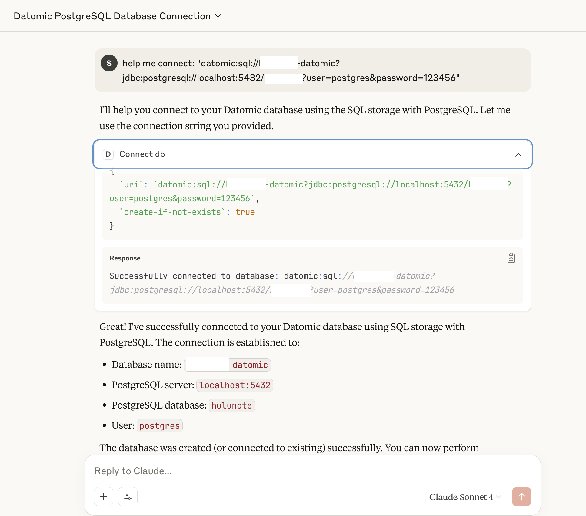
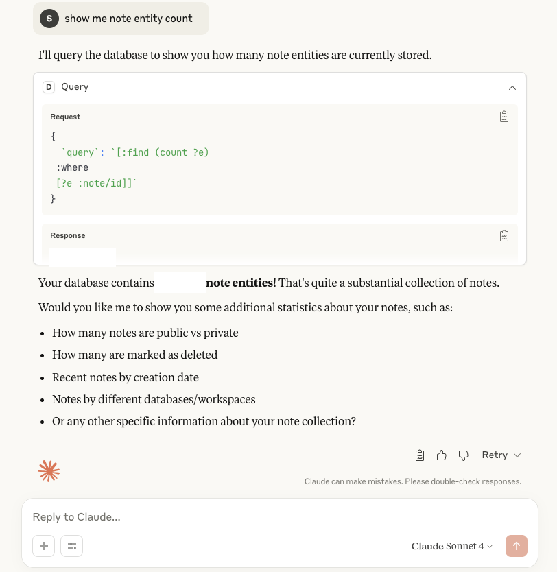
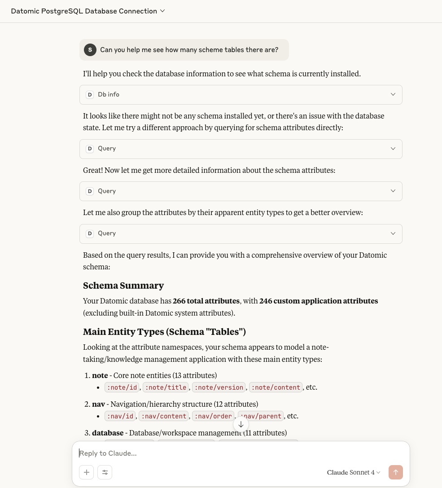

# ⚡ Datomic MCP Server

**AI. Query. Persist. Extend.**  
A robust Clojure-based MCP server designed for querying **Datomic** databases and integrating with AI-powered workflows.

---

## 🔍 Key Features

### 🗄️ Connect to Datomic (SQL / Dev / Cloud)

* Seamlessly connect to your Datomic database and run queries directly from AI workflows.  
* Works with **Datomic Pro** (SQL, Dev-local) and **Datomic Cloud** setups.

### 📂 Query entity relationships



### 📊 Aggregate queries & computations



### 🧾 Entity properties and history

* Explore entity attributes  
* Query temporal history (as-of, since)  
* Transaction-time navigation



---

## ⚙️ Getting Started

### ▶️ Run the MCP Server

Run with Clojure CLI:

```bash
clojure -X:mcp
````

Or from Emacs REPL:

```clojure
(mcp-server)
```

---

### ✅ Check Server Health

Use the following command to verify the MCP server is up and responding to JSON-RPC:

```bash
echo '{"jsonrpc": "2.0", "id": 1, "method": "initialize", "params": {"protocolVersion": "2024-11-05", "capabilities": {}, "clientInfo": {"name": "test", "version": "1.0"}}}' \
| /usr/local/bin/clojure -M -m datomic-mcp.core
```

Expected response:

```
Datomic MCP Server running on STDIO transport.
{"jsonrpc":"2.0","method":"notifications/tools/list_changed"}
...
{"jsonrpc":"2.0","id":1,"result":{"protocolVersion":"2024-11-05","capabilities":{"logging":{},"tools":{"listChanged":true}},"serverInfo":{"name":"datomic-server","version":"0.1.0"}}}
```

---

## 🖥️ MCP Client Configuration (Claude Desktop)

Example client setup for launching the server from Claude Desktop:

```json
{
    "datomic-mcp": {
      "command": "/bin/bash",
        "args": [
          "-c",
          "cd /Users/xlisp/CljPro/datomic-mcp-server && /usr/local/bin/clojure -M -m datomic-mcp.core"
        ]
    }

...

}
```

* Tools
  

---

## 🔮 Roadmap

inspired by https://github.com/xlisp/datascript-mcp-server

1. **Query live Datomic databases** 👉 connect to SQL / Dev-local / Cloud
2. **Hybrid queries across Datomic + DataScript** 👉 offline + persistent data https://github.com/xlisp/datascript-mcp-server
3. **Visualize Datomic relationships** 👉 [Visualization MCP Server](https://github.com/xlisp/visualization-mcp-server)
4. **Import/export datasets** 👉 transit, edn, or AI-generated inserts
5. **Filesystem MCP integration** 👉 browse schema & migrations https://github.com/xlisp/filesystem-mcp-server
6. **Support Datomic history queries** 👉 temporal navigation (as-of, since, history)

---

## Contributing

1. Fork the repository
2. Create a feature branch (`git checkout -b feature/amazing-feature`)
3. Commit your changes (`git commit -m 'Add amazing feature'`)
4. Push to the branch (`git push origin feature/amazing-feature`)
5. Open a Pull Request

---

## License

This project is licensed under the MIT License - see the [LICENSE](LICENSE) file for details.

---

## FQA

### change list

- [x] Datomic in-memory database already supports
- [x] Connect any Datomic database url

### Run in JDK 17 (datomic client)

```
export JAVA_HOME="/Library/Java/JavaVirtualMachines/microsoft-17.jdk/Contents/Home" #'/Library/Java/JavaVirtualMachines/microsoft-11.jdk/Contents/Home'
export PATH=$JAVA_HOME/bin:$PATH
export CPPFLAGS="-I/Library/Java/JavaVirtualMachines/microsoft-17.jdk/Contents/Home/include"

```

### Run datomic transactor

* datomic-pro-1.0.6165 transactor must run on java 1.8 ( brew install openjdk@8 ), other jdk will errors `Execution error (ActiveMQInternalErrorException) at org.apache.activemq.artemis.core.protocol.core.impl.ChannelImpl/sendBlocking (ChannelImpl.java:404).`
```
➜  datomic-pro-1.0.6165 ./rundatomic.sh
Launching with Java options -server -Xms4g -Xmx4g -XX:+UseG1GC -XX:MaxGCPauseMillis=50
Starting datomic:sql://<DB-NAME>?jdbc:postgresql://localhost:5432/db123123?user=postgres&password=123456, you may need to change the user and password parameters to work with your jdbc driver ...

```

---

**Built with Clojure. Powered by Datomic. Inspired by the future of persistent querying.**
*In the Source we trust.*

